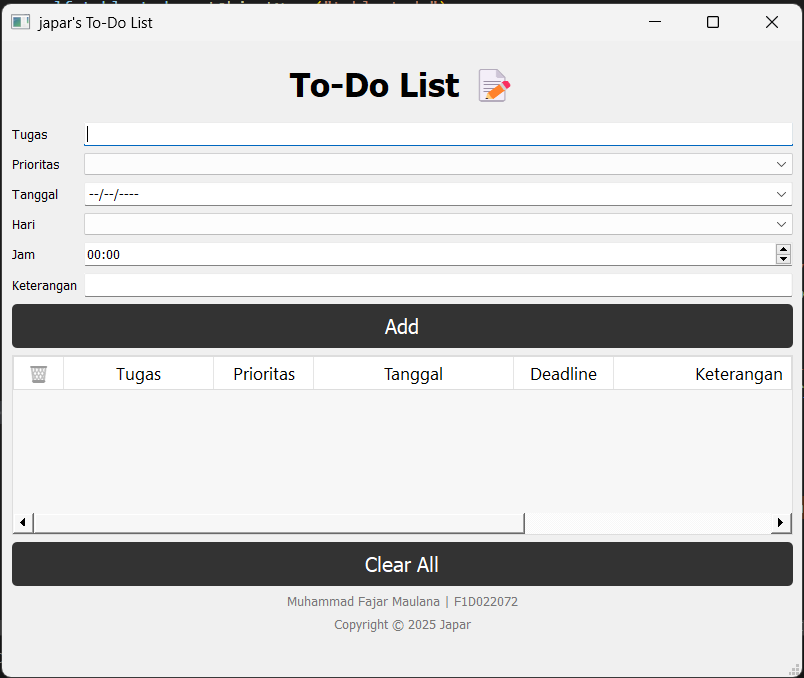

# pv25-miniproject-mytodolist

### Tugas UTS Mini Project Untuk memenuhi tugas mata kuliah Pmerograman Visual, dibuat menggunakan PyQt5 yang akan membatu user untuk mencatat kegiatannya, Aplikasi ini memiliki fitur utama dimana user dapat menginputkan rincian tugas kemudian aplikasi ini akan merekam list dari tugas user, berikut adalah tampilan awal dari aplikasi To-Do List ini

Tampilan Awal

